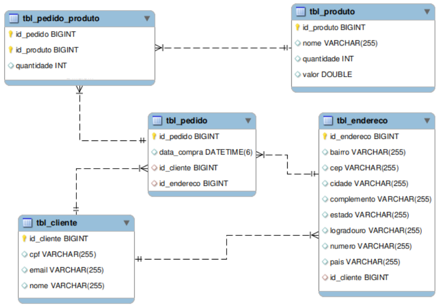

# Persistence

O objetivo neste projeto foi usar a tecnologia *Spring Data JPA* para realizar todas as operações de CRUD nas tabelas de um banco de dados relacional. 

## Estrutura do projeto

O projeto Persistence foi criado com *Spring Boot* e está organizado da seguinte maneira: 

- O pacote *config* possui a classe de configuração e o *Swagger*;
- O pacote *entity* contém as definições das entidades deste projeto;
- O pacote *repository* contém as interfaces responsáveis pelas operações no banco de dados;
- O pacote *service* contém as interfaces de cada entidade bem como as respectivas implementações. Nas implementações dessas interfaces são onde estão as regras de negócios do projeto.
- O pacote *controller* contém as classes que definem os *endpoints*. Esses *endpoints* são os que provê as interações com os serviços da aplicação.
- O pacote *dto* contém as classes que implementam o padrão de desenvolvimento DTO para os campos essenciais nas interações de alguns serviços.

O *Lombok* foi usado nas classes do pacote *entity* para tornar mais enxuto o código delas. As dependências foram gerenciadas com o *Maven* e o *MySQL* foi o SGBD escolhido para este projeto.

## Diagrama do banco de dados


## Instruções para executar

Se preferir, a infraestrutura necessária para a execução do projeto pode ser obtida da imagem para Docker que está disponível neste repositório sob o nome de persistence.yml. A imagem pode ser usada com os comandos docker ou docker-compose conforme exemplos a seguir:

```bash
docker stack deploy -compose-file persistence.yml fiap
```

ou

```bash
docker-compose -f persistence.yml up
```

Em seguida, o projeto pode ser executado por meio da classe PersistenceApplication. Ou ainda, na raiz do projeto pelo terminal, executar o comando: 

```bash
./mvnw spring-boot:run
```

As interações com os serviços podem ser feitas por meio do endereço:

*http://127.0.0.1:8080/swagger-ui.html*

Nesse endereço está a documentação do projeto, os endpoints disponíveis e o que cada um deles espera como entrada.

## Integrantes

- Carlos Henrique Antunes Mendes;
- Felipe Birches Lopes;
- Guilherme Moreira De Brito Moraes;
- Leonardo Villani;
- Luiz Armando Galesso.

## Referências

- https://spring.io/projects/spring-boot
- https://spring.io/projects/spring-data-jpa
- https://swagger.io/
- https://projectlombok.org/
- https://maven.apache.org/
- https://www.mysql.com/
- https://www.docker.com/