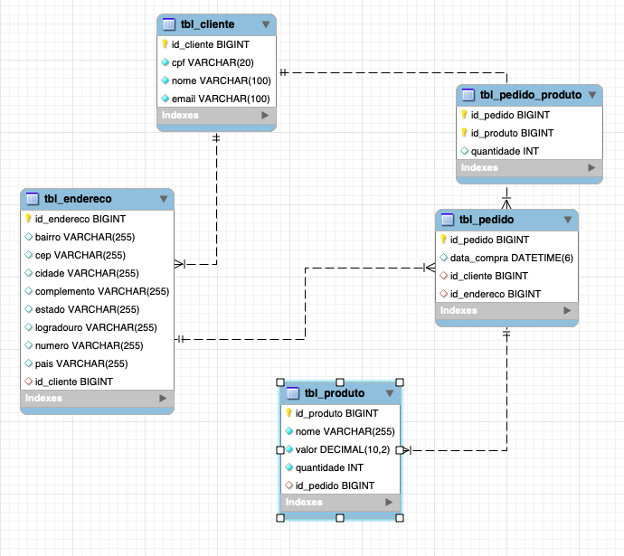

# Persistence

O projeto **Persistence** tem o intuito de ter as tabelas em um banco relacional e fazer todas as operações de CRUD de clientes, endereços, produtos e pedidos.

*Estrutura do projeto*
O projeto foi feito utilizando o Spring Boot, e foi dividido da seguinte forma: pacote de config que possui uma classe para configuração e uso do Swagger, pacote entity que representam as entidades, pacote repository onde constam as interfaces que farão as operações no banco de dados, pacote service, onde para cada entidade possui uma interface que fornece os métodos que poderão ser implementados e uma classe de implementação que de fato implementa a regra de negócio, onde ao fazer um pedido, a quantidade de produtos é decrementada do estoque, e se o pedido for deletado a quantidade é incrementada, existe também o pacote controller onde estão disponíveis as classes que contém os endpoints para fazer a interação com os serviços, existe o pacote dto, para casos onde para facilitar o uso, são requiridas apenas campos essenciais para interagir com o serviço.

**Diagrama do banco de dados**

